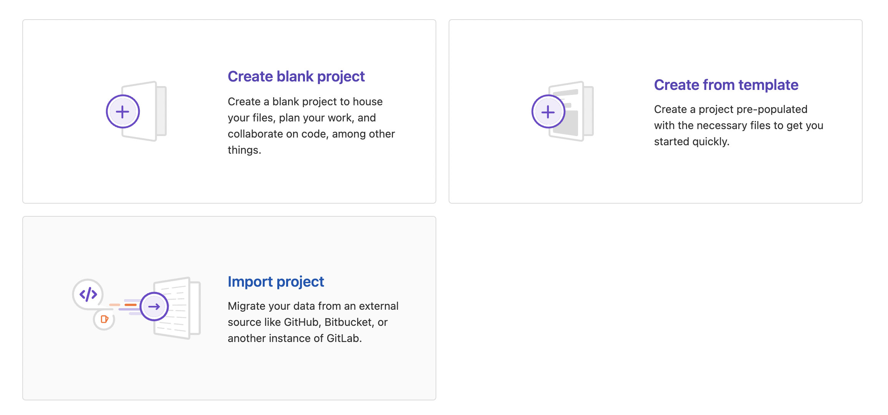
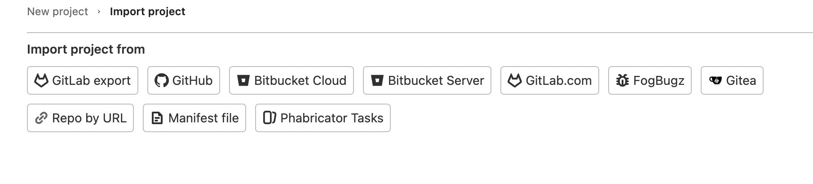
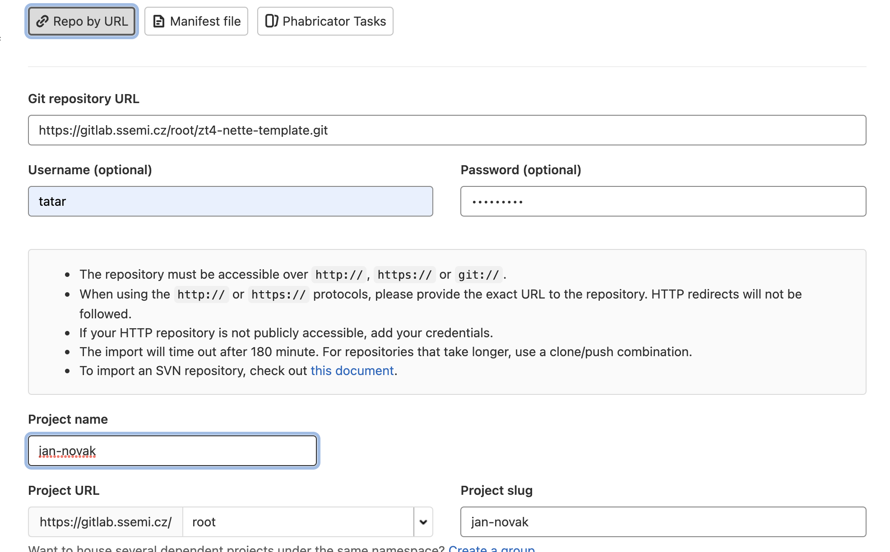
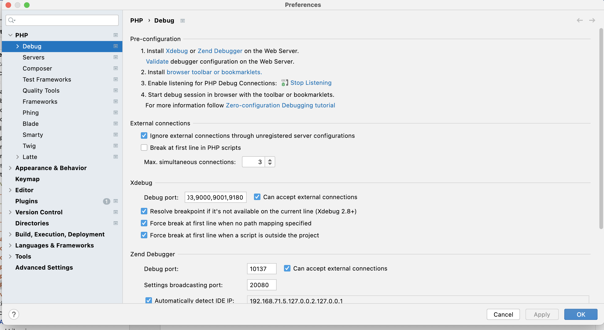
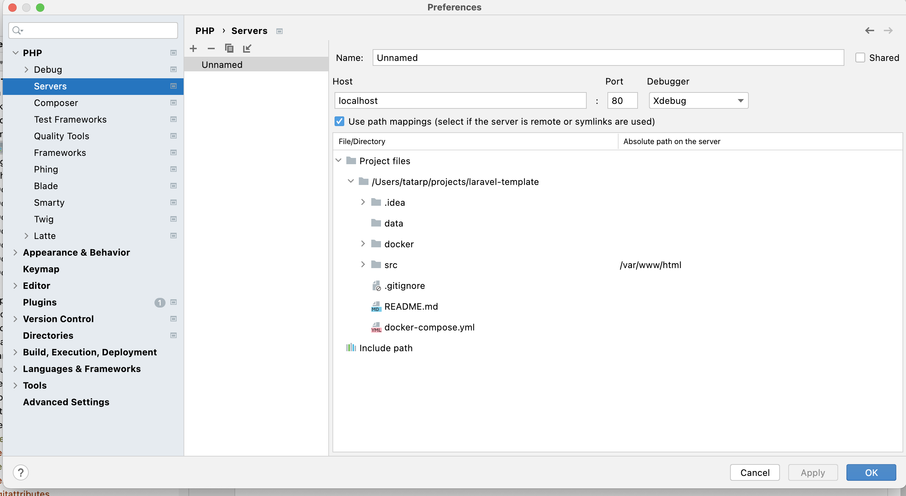

# IT2-DOCKER

Tento template je vhodné si naklonovat rovnou už v GitLabu, protože
projekt už bude mít pojmenování podle vašeho přání.
Součástí template je i konfigurace DOCKERU.

## Import do nového projektu krok 1
Zde vybereme "Import projekt".



## Import do nového projektu krok 2
Zde vybereme "Repo by URL.



## Import do nového projektu krok 3
Vyplnění údajů pro import template do vašeho nového projektu:
##### 1, Git repository URL - URL zdrojového repozitáře (můj template)
##### 2, Username (optional) - vaše přihlašovací jméno
##### 3, Password (optional) - vaše přihlašovací heslo
##### 4, Project name - jméno nového projektu
##### 5, Visibility Level - viditelnost projektu



## Nastavení xdebug


Nastavení debug a portů:




Nastavení cesty k projektu a uvnitř kontejneru:



## Základní příkazy pro konfiguraci kontejneru

#### Build image
```sh
docker-compose build
```
Toto by melo stahnout a nastavit vše potřebné

#### Sestaveni a spustení kontejneru
```sh
docker-compose up  -d nebo
docker-compose up -d --build
```
V tuto chvili by mel byt docker projekt ready na http://localhost:82 viz soubor docker-compose.yml,
kde to jde i změnit. --build používáme pro přegenerování image kontejneru.
```sh
http://localhost:85
```

#### ukončení kontejneru
```sh
docker-compose down  
```
Potom je možné i na stejný port spustit jiný kontejner.

## SQL databáze a adminer

Součásti konfigurace je SQL databáze a adminer. Najdeme jí na url:
```sh
http://localhost:82/adminer
```
Databáze mezi kontejnery je na portu 3306 viz soubor docker-compose.yml.
Není potřeba psát do připojení k databázi IP a port. Stačí název service
ze souboru docker-compose.yml vč. jména root a hesla.
```sh
mysqldb
```
Neukládejte na Gitlab soubory DB, pouze sql dump. Jedná se o adresář ./data/database, který musí zůstat
git ignore.
```


